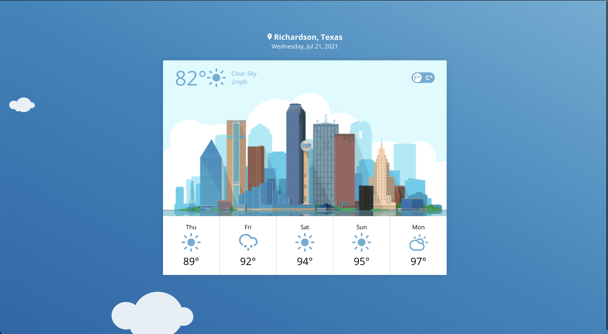
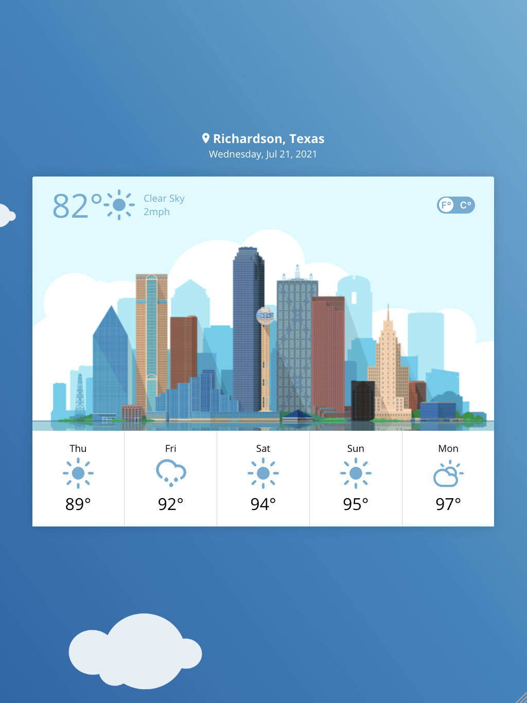
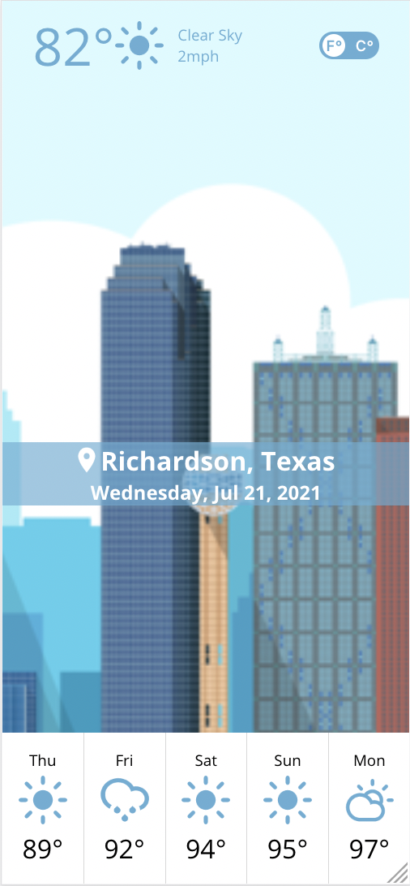

# Rain | Shine
Rain or Shine - your favorite new weather app.

https://rain-or-shine.jmdarling.com

## Preview
### Desktop


### Tablet


### Mobile



## Developing
### Install Dependencies
```shell
yarn install
```

### Local Development Server
```shell
yarn start
```

### Unit Tests
```shell
yarn test
```

### Code Formatting
```shell
yarn format
```

## Tooling
### Component Framework
[React](https://www.npmjs.com/package/react) (boilerplate by [create-react-app](https://www.npmjs.com/package/create-react-app))

### Unit Testing
_The application is currently lacking proper unit test coverage_

[Jest](https://www.npmjs.com/package/jest) + [Enzyme](https://www.npmjs.com/package/enzyme)

### Code Formatting
[Prettier](https://www.npmjs.com/package/prettier)

## Services
### Weather
[OpenWeatherMap](https://openweathermap.org/) was chosen due to its generous free usage tier, and the robustness of its API.

### Reverse Geo-Coding
[OpenCage](https://opencagedata.com/) was chosen due to its generous free tier, and its (fairly unique) terms allowing it to be used standalone, without usage of a corresponding Map API.

## Major TODOs
### Tech
#### Unit Test Coverage
The application currently has very little Unit Test coverage due to the tight implementation period. This should be of top priority to remediate.

#### End to End Test Coverage
The application currently has no End to End test framework. End to End tests would compliment Unit Tests to ensure a consistent, bug-free end user experience.

### Functionality
#### Fallback Interface When Location Services Unavailable
As of right now, the application requires the end-user to have location services enabled, and they must agree to a prompt to allow short-term access. For users who do not wish to provide this access, a fallback experience should be implemented to allow for manual entering of location via Zip Code, Address, or the like.

#### Support For Multiple City Backgrounds
The application background is currently limited to only showing imagery of Dallas. This should be expanded to allow imagery of more major cities, and fallback imagery should be provided should the user not be near a major city.
